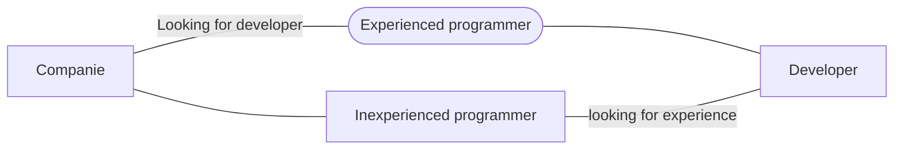

# Movies app

That challenge is all about to create an App that can call an API with info about movies and put all the information together like `Details, Date, Description, Name, Trailler, Categories, and more.`

## API
I've used The Movie Database API to request all the information needed;  
I choose this API cuz was simple and complete; i really loved to work with that;  
Link to API (**docs**) -> [The Movie DB.](https://developers.themoviedb.org/3/getting-started/introduction)

## Technologies i've used

 - **MVVM** - Architecture choosed;
 - **Retrofit** - To get API requests;
 - **Coroutines** - Asynchronous programming ;
 - **RecyclerView** - To list data;
 - **DataBinding** - To change UI data with less pollution in activity;
 - **LifeCycle** - Android lifecycle to avoid errors/crashs;
 - **Koin** - First time dependency injection to make a cleaner code;

# Current state

#### That's the current state of the app, I'll try my best to keep the app true to the design and utilize all technologies i've previously listed.

### Checkboxes

 - [x] Project idea;
 - [x] Design;
 - [x] Readme;
 - [x] Project setup;
 - [ ] Gradle updated;
 - [ ]  Architeture;
 - [ ]  API connection;
 - [ ]  Main screen design;
 - [ ]  Moviedetails screen;
 - [ ]  API data;
 - [ ]  Main screen redesign with API data;
 - [ ]  Moviedetails screen with API data;
 - [ ]  Trailler calling for a YT video;
 - [ ]  Like animation filling the heart with red;
 - [ ]  Similar movies {**not listed as required, it's a plus**};
 - [ ]  Have the project available on Github;
 - [ ]  Publish the app on Play Store {**not listed as required, it's a plus**};
 - [ ]  Loading animation{**not listed as required, it's a plus**};

## Updates with dates
> **Note:** The dates may be a little off due to forgetting to update them in real time;

**2022** - 	*Project Idea**  
**2022** - *Project Design*  
**23/03/2022** - *README creation*  

## Language

Which language and why did I choose?

|                |Kotlin                          |JAVA                         |
|----------------|-------------------------------|-----------------------------|
|Code			 	  |**It's not that complex**     |*A more complex and larger syntax*|            
|Popularity     	  |**It's gaining popularity after Kotlin first**            |*More popular making it easy to find guides about bugs and doubts*         |
|Community       	  |**Small community, but it's not impossible to find people**|*Huge community which makes it possible to make connections quickly* |
|NullPointerException |**The code won't work if you set it to null unless you do certain things...**|*Well well well* |

# APP Screenshot/Videos

  

## Diagram about companies

> Situation of companies today.

